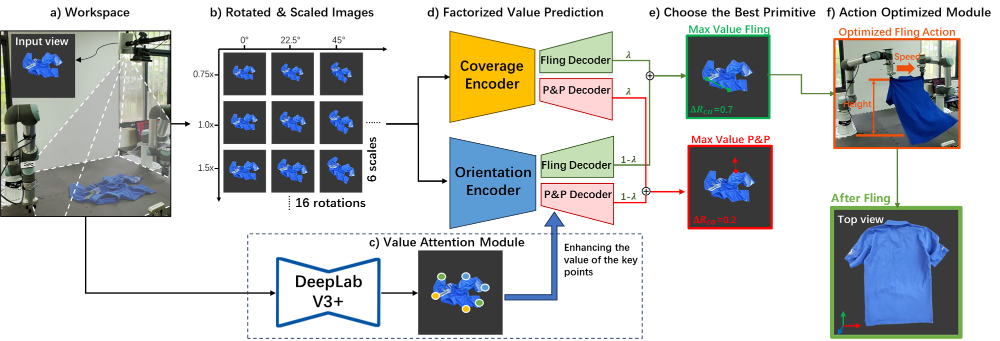

<h1>Oriented-unfolding </h1>
<div style="text-align: center;">

[Ningquan Gu](https://www.github.com/ningquan-gu), [Ruhan He](), [Lianqing Yu]()

Wuhan Textile University, Hubei, China

[Simulation and Real World Videos](https://youtu.be/UCYhlFXkrGw) 
<div align="center">
  
</div>

This is a portion of the code, with the complete code soon to update.

</div>

<!--  -->

<!-- center image above -->

<!-- <div style="display:flex; justify-content: center;">

</div> -->

<div align="center">
  
</div>

<br>

# Table of Contents

- 1 [Simulation](#simulation)
  - 1.1 [Setup](#setup)
  - 1.2 [Evaluate Oriented Unfolding](#evaluate-oriented)
  - 1.3 [Train Your Model](#train-oriented)

# Simulation

## Setup 🛠️

This section walks you through setting up the CUDA accelerated cloth simulation environment.
To start, install [Blender2.79](https://www.blender.org/download/), [docker](https://docs.docker.com/engine/install/ubuntu/) and [nvidia-docker](https://github.com/NVIDIA/nvidia-docker#quickstart).

### Python Dependencies

```
conda env create -f environment.yml
pip install -e .
```

### Compiling the simulator

This codebases uses a CUDA accelerated cloth simulator which is a fork of [PyFlex](https://github.com/YunzhuLi/PyFleX) from [Softgym](https://github.com/Xingyu-Lin/softgym), and requires a GPU to run.
We have provided a Dockerfile in this repo for compiling and using this simulation environment for training in Docker.

```
cd oriented_unfolding
docker build -t oriented-unfolding .
```

To launch the docker container, go to the `oriented_unfolding` subdirectory, then run

```
export ORIENTED_UNFOLDING_PATH=${PWD}
sudo nvidia-docker run \
	-v $ORIENTED_UNFOLDING_PATH:/workspace/oriented_unfolding \
	-v /path/to/your/anaconda3:/path/to/your/anaconda3 \
	--gpus all --shm-size=64gb  -d -e DISPLAY=$DISPLAY -e QT_X11_NO_MITSHM=1 -it oriented-unfolding
```

```sh
export PATH=/path/to/your/anaconda3/bin:$PATH
conda init bash
source ~/.bashrc
conda activate oriented-unfolding
```

Then, inside the `oriented_unfolding` directory within the docker container, compile the simulator with

```
cd oriented_unfolding
. ./prepare.sh && ./compile.sh
```

### Models + Task Dataset

You can download the pretrained models [here](https://drive.google.com/file/d/1vGJABDChqJIr6T47QDqfLz8tY6Z70ZyB/view) and the task dataset [here](https://drive.google.com/file/d/1qMRs7c4ckIRQVPyFWQoAKgE3n_kXUhUp/view).
The models should be stored in `oriented-unfolding/models/` and the datasets will be stored in `oriented-unfolding/assets/tasks/`.


## Evaluate Oriented Unfolding 

To evaluate a demo on a single garment instance, ensure that you have specified at least one GPU on the `CUDA_VISIBLE_DEVICES` environment variable, and run the following command from the root directory

```
export CUDA_VISIBLE_DEVICES=0
python oriented_unfolding/run_sim.py\
    name="demo" \
    load=../models/oriented-unfolding.pth \
    eval_tasks=../assets/tasks/tshirt-single.hdf5 \
    eval=True \
    num_processes=1 \
    episode_length=10 \
    wandb=disabled \
    dump_visualizations=True
```

The result will appear in the `oriented_unfolding/experiments` directory under the name `demo`. Inside the experiment directory, you can find the episode replay buffer along with a video of the executed episode.

<div align="center">
  
</div>

## Train Your Model 

Train the model from scratch on T-shirt datase.

```sh
export CUDA_VISIBLE_DEVICES=0,1,2,3
python oriented_unfolding/run_sim.py name="tshirt" \
    num_processes=16
```

Make sure to change `num_processes` appropriately for your GPU memory capacity. Once the run starts, you can visualize the training on the corresponding Weights and Biases dashboard.

 If you would like resume a run, you may execute the following command

```
python oriented_unfolding/run_sim.py cont=[path to run]
```